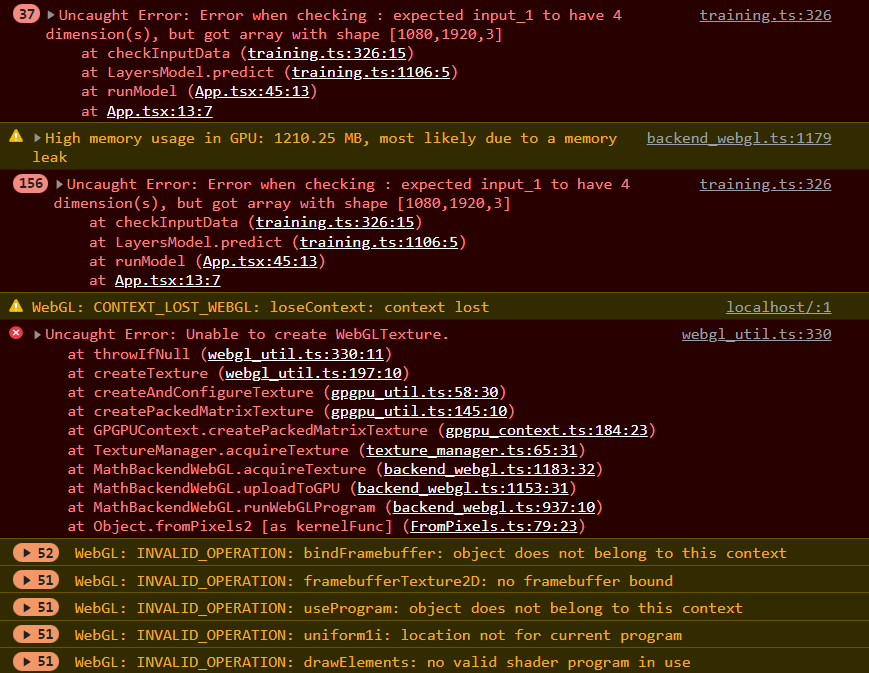
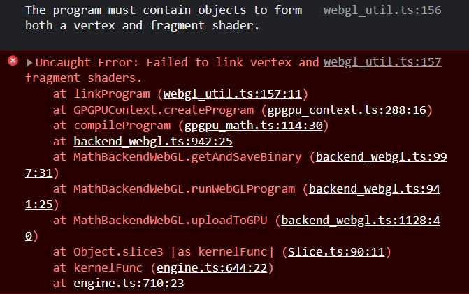

# Keras models in Tensorflow.js

Model used (yolov2_tiny-face.h5): https://github.com/abars/YoloKerasFaceDetection/releases/tag/1.0.0
Used these docs to convert the keras models(.h5 format) to tensorflow.js compatible: https://www.tensorflow.org/js/tutorials/conversion/import_keras

### Progress
- Converted model without any issues.
- Model is loaded in browser.
- Unable to use the model properly: 
  - Resolved last error, by resizing the tf image, and converting it into 4D tensor
  
  - Currently facing this error:
  
- Resolved these errors, getting some output (output is a tensor, don't know what info can we get from it)