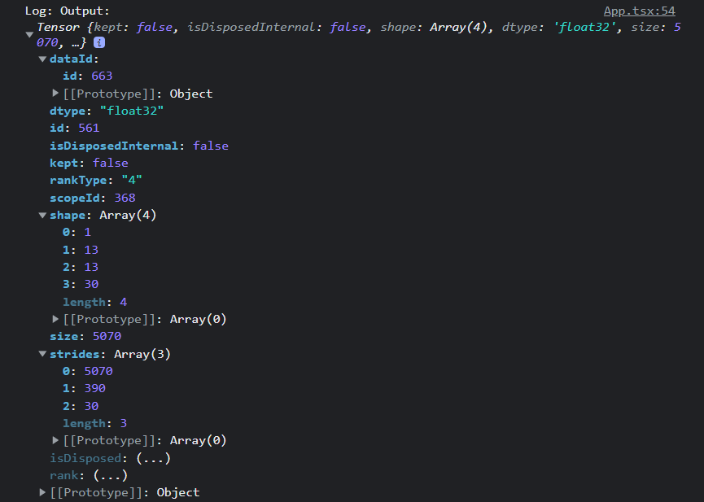

# Keras models in Tensorflow.js

Model used (yolov2_tiny-face.h5): https://github.com/abars/YoloKerasFaceDetection/releases/tag/1.0.0
Used these docs to convert the keras models(.h5 format) to tensorflow.js compatible: https://www.tensorflow.org/js/tutorials/conversion/import_keras

### Progress
- Converted model without any issues.
- Model is loaded in browser.
- Unable to use the model properly: 
  - Resolved last error, by resizing the tf image, and converting it into 4D tensor
    
  - Currently facing this error:
    
- Resolved these errors, getting some output (output is a tensor, don't know what info can we get from it)
  
- Resolved these errors with these resources:
  - Model config file: https://github.com/abars/YoloKerasFaceDetection/blob/master/darknet_yolov2/cfg/yolov2-tiny-train-one-class.cfg
  - TensorflowJS github issue: https://github.com/tensorflow/tfjs/issues/193

### Some Insights
- Model is giving some output
  - Model is predicting something (means working, finally 😅)
  - Giving us the predicted output as a Tensor4D
  - We need to interpret this Tensor4D output to get our face detection
  - Currently emulating the python interpretation of this Tensor4D output in tensorflowjs
  - The function I'm emulating: [permalink](https://github.com/abars/YoloKerasFaceDetection/blob/5d0f51099b619de581ec9e2b7823e9f9d35a0868/agegender_demo.py#L86)