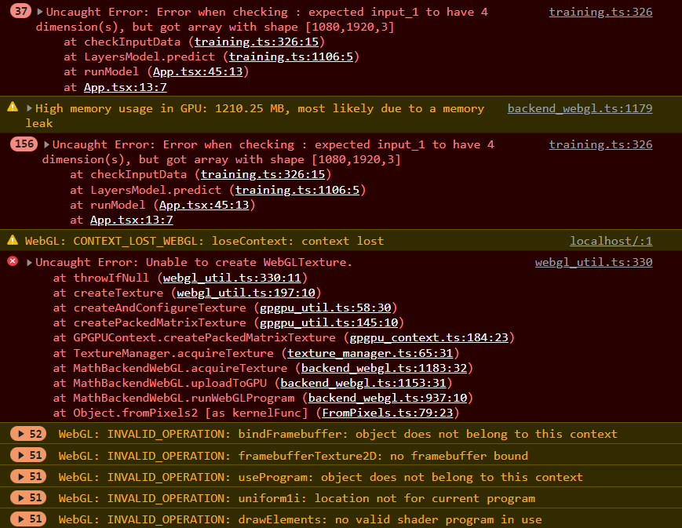

# Keras models in Tensorflow.js

Used these docs to convert the keras models(.h5 format) to tensorflow.js compatible: https://www.tensorflow.org/js/tutorials/conversion/import_keras

### Progress
- Model is converted without any issues.
- Model is loaded in browser.
- Unable to use the model properly, currently facing this issue:
