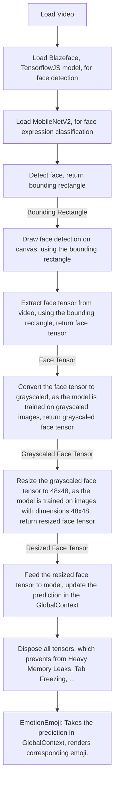

<h1 align="center">
    
    <a href="https://keras-models-in-tfjs.netlify.app">
        <span valign="middle">
                Keras models in TensorflowJS
        </span>
    </a>
</h1>


This web app uses a model made in python(using [Keras](https://keras.io/)), in the browser with [TensorflowJS](https://tensorflow.org/js/).
The model is converted from Keras(.h5 or .hdf5) to TensorflowJS compatible with the help of this tool: [TensorflowJS Converter](https://www.tensorflow.org/js/tutorials/conversion/import_keras).

Keras model is taken from this [repo](https://github.com/liminze/Real-time-Facial-Expression-Recognition-and-Fast-Face-Detection/tree/master/models/best_model).
Converted model is [here](https://github.com/Eessh/keras-models-in-tfjs/tree/master/public/converted_models/FaceExpression-MUL_KSIZE_MobileNet_v2_best).

## Data Flow



## To run on local server
```bash
git clone https://github.com/Eessh/keras-models-in-tfjs.git
cd keras-models-in-tfjs/
npm install
npm run dev
```
