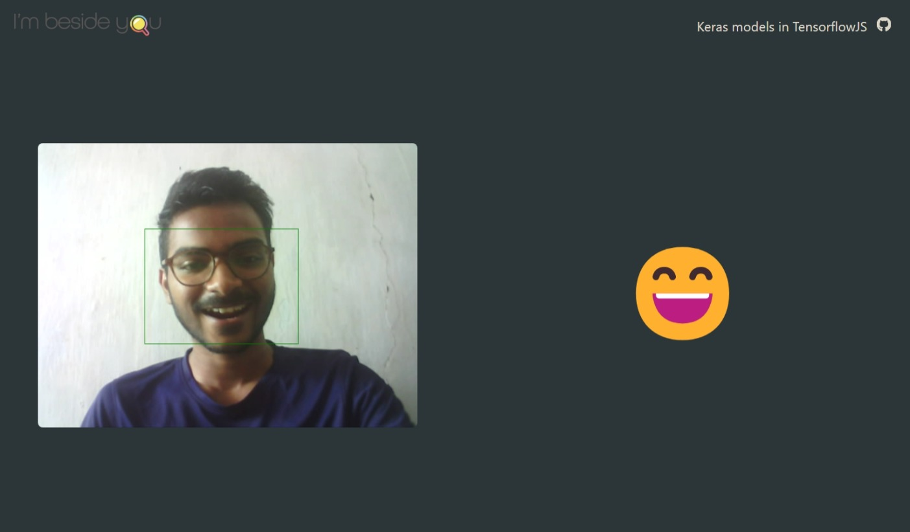

# Keras models in Tensorflow.js



This web app uses a model made in python(using [Keras](https://keras.io/)), in the browser with [TensorflowJS](https://tensorflow.org/js/).
The model is converted from Keras(.h5 or .hdf5) to TensorflowJS compatible with the help of this tool: [TensorflowJS Converter](https://www.tensorflow.org/js/tutorials/conversion/import_keras).

Keras model is taken from this [repo](https://github.com/liminze/Real-time-Facial-Expression-Recognition-and-Fast-Face-Detection/tree/master/models/best_model).
Converted model is [here](https://github.com/Eessh/keras-models-in-tfjs/tree/master/public/converted_models/FaceExpression-MUL_KSIZE_MobileNet_v2_best).

### Data Flow

```mermaid
flowchart TD
  A[Load Video] --> B[Load Blazeface (TensorflowJS model, for face detection)];
  B --> C[Load MobileNetV2 (for face expression classification)];
  C --> D[Detect face, return bounding rectangle]
  D --> |Bounding Rectangle| --> E[Draw face detection on canvas, using the bounding rectangle]
  E --> F[Extract face tensor from video, using the bounding rectangle, return face tensor]
  F --> |Face Tensor| --> G[Convert the face tensor to grayscaled, as the model is trained on grayscaled images, return grayscaled face tensor]
  G --> |Grayscaleed Face Tensor| --> H[Resize the grayscaled face tensor to 48x48, as the model is trained on images with dimensions 48x48, return resized face tensor]
  H --> |Resized Face Tensor| --> I[Feed the resized face tensor to model, update the prediction in the GlobalContext, dispose all tensors]
  I --> J[EmotionEmoji: Takes the prediction in GlobalContext, renders corresponding emoji.]
```